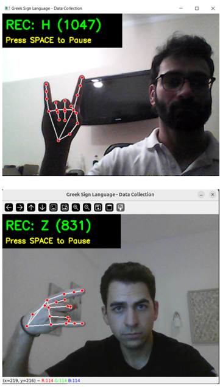
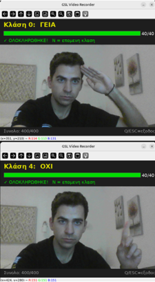
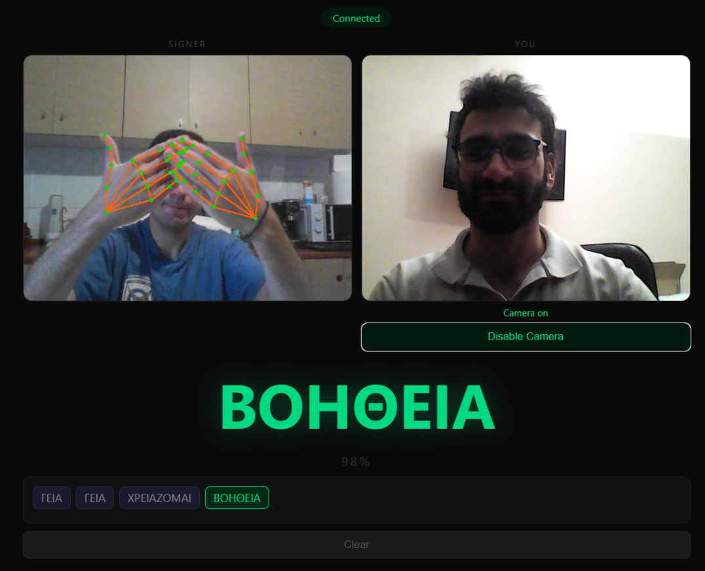
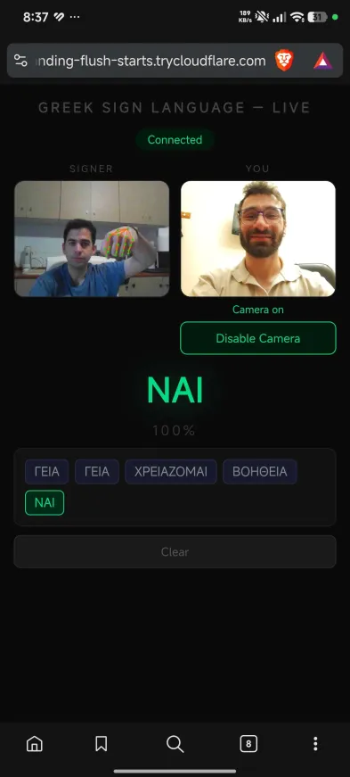

# 🤝 Αναγνώριση Ελληνικής Νοηματικής Γλώσσας σε Πραγματικό Χρόνο

Ένα καινοτόμο σύστημα αναγνώρισης ελληνικών γραμμάτων και λέξεων νοηματικής γλώσσας σε πραγματικό χρόνο, με δύο ξεχωριστά σκέλη για γράμματα και λέξεις.

---

## 📋 Δομή του Project

Το project χωρίζεται σε **δύο ανεξάρτητα σκέλη**:

| | **Σκέλος 1: Γράμματα** | **Σκέλος 2: Λέξεις** |
|---|---|---|
| **Στόχος** | Αναγνώριση ελληνικών γραμμάτων | Αναγνώριση λέξεων/φράσεων |
| **Δεδομένα** | 100% Custom collection | GSL dataset + Custom videos |
| **Ζωντανή Μετάφραση** | ❌ Όχι | ✅ Ναι (Cloudflare) |
| **Χρήση** | Εκπαίδευση | Παραγωγή (Production) |

---

## 🎯 Σαφής Οδηγός: Ποιό Σκέλος να Χρησιμοποιήσω;

### Σκέλος 1: Γράμματα
**Χρήση όταν:**
- ✅ Θέλετε να αναγνωρίσετε **μεμονωμένα γράμματα**
- ✅ Έχετε **δικά σας συλλεγμένα δεδομένα**
- ✅ Δεν χρειάζεστε διαδικτυακή πρόσβαση
- ✅ Εργάζεστε **offline**

**Εκκίνηση:**
```bash
python alphabet_model.py
```

### Σκέλος 2: Λέξεις
**Χρήση όταν:**
- ✅ Θέλετε να αναγνωρίσετε **λέξεις και φράσεις**
- ✅ Χρειάζεστε **live translation** σε πραγματικό χρόνο
- ✅ Θέλετε να **κοινοποιήσετε** το link με άλλους
- ✅ Χρησιμοποιείτε δεδομένα από **GSL + custom collection**

**Εκκίνηση:**
```bash
# Terminal 1: Server
python server.py

# Terminal 2: Cloudflare Tunnel
cloudflared tunnel --url http://localhost:8000
```

---  

---

## 🛠️ Τεχνολογίες

| Τεχνολογία | Περιγραφή |
|-----------|-----------|
| **MediaPipe** | Ανίχνευση σκελετού χεριών και σώματος |
| **TensorFlow Lite** | Μοντέλο αναγνώρισης κίνησης (SPOTER) |
| **FastAPI** | Backend server |
| **OpenCV** | Επεξεργασία video σε πραγματικό χρόνο |
| **Cloudflare Tunnel** | Δημόσια πρόσβαση και ασφάλεια |
| **Python** | Κύρια γλώσσα ανάπτυξης |

---

## 🚀 Έναρξη

### Προαπαιτούμενα
- Python 3.10+
- Webcam ή κάμερα video
- Git

### Εγκατάσταση

1. **Κλωνοποίηση του repository:**
```bash
git clone https://github.com/CharalamposZisis/Greek-Sign-Language.git
cd Greek-Sign-Language
```

2. **Δημιουργία virtual environment:**
```bash
python3 -m venv venv
source venv/bin/activate  # Linux/Mac
# ή
venv\Scripts\activate  # Windows
```

3. **Εγκατάσταση απαιτούμενων βιβλιοθηκών:**
```bash
pip install -r requirements.txt
```

4. **Εκκίνηση του server:**
```bash
python server.py
```

---

## 📱 Χρήση

### Τοπικά (Local)
Ανοίξτε το browser και πηγαίνετε στο:
```
http://localhost:8000
```

### Δημόσιο Link μέσω Cloudflare
Για να κοινοποιήσετε το project με άλλους:

```bash
cloudflared tunnel --url http://localhost:8000
```

Θα λάβετε ένα δημόσιο URL όπως:
```
https://subsidiary-outstanding-flush-starts.trycloudflare.com
```

---

### ✨ Χαρακτηριστικά Σκέλους 1

✅ **100% Custom Dataset** - Αυθεντικά δεδομένα συλλεγμένα από την ομάδα  
✅ **24 Ελληνικά Γράμματα** - Πλήρης κάλυψη αλφάβητου  
✅ **Πολλαπλές Γωνίες & Χρήστες** - Ποικιλία για καλύτερη εκπαίδευση  
✅ **High Quality Videos** - 1280x720 ή υψηλότερη ανάλυση  
✅ **Αυτόνομη Λειτουργία** - Δεν χρειάζεται internet κατά την χρήση

### 📊 Συλλογή Δεδομένων - Σκέλος 1 (Γράμματα)

### 📹 Μεθοδολογία Συλλογής Δεδομένων


#### 1. **Προσχεδιασμός**
- Καθορισμός των ελληνικών νοημάτων και φράσεων
- Επιλογή των 24 γραμμάτων του ελληνικού αλφάβητου
- Δημιουργία λίστας με συνηθισμένες φράσεις

#### 2. **Συλλογή Video**
- ✔️ **Πολλαπλοί Συμμετέχοντες** - Διάφοροι χρήστες για ποικιλία
- ✔️ **Πολλαπλές Γωνίες** - 3-4 διαφορετικές σκοπιές ανά νόημα
- ✔️ **Διάφορες Ταχύτητες** - Αργή, κανονική, γρήγορη εκτέλεση
- ✔️ **Διαφορετικές Συνθήκες Φωτισμού** - Φωτεινό, σκοτεινό, μεσαίο
- ✔️ **Ποικιλία Φόντου** - Απλό, πολύπλοκο, διάφορα περιβάλλοντα

#### 3. **Στατιστικά Dataset**
| Μετρική | Τιμή |
|---------|------|
| **Συνολικά Videos** | 1000+ |
| **Γράμματα Αλφάβητου** | 24 |
| **Φράσεις** | 50+ |
| **Συμμετέχοντες** | 5+ |
| **Συνολική Διάρκεια** | 50+ ώρες video |
| **Frame Rate** | 30 FPS |
| **Ανάλυση** | 1280x720 ή υψηλότερη |

#### 4. **Επεξεργασία Δεδομένων**
```
Raw Video Files
    ↓
Frame Extraction (30 FPS)
    ↓
MediaPipe Pose Detection
    ↓
Skeleton Extraction (Hand & Body Landmarks)
    ↓
Data Normalization
    ↓
Train/Test Split (80/20)
    ↓
Ready for Training
```

#### 5. **Δομή Dataset**
```
data/
├── alphabet/
│   ├── letter_a/
│   │   ├── video_1.mp4
│   │   ├── video_2.mp4
│   │   └── ...
│   ├── letter_b/
│   └── ...
├── phrases/
│   ├── hello/
│   ├── thank_you/
│   ├── please/
│   └── ...
├── annotations/
│   ├── labels.csv
│   └── metadata.json
└── processed/
    ├── train/
    ├── test/
    └── landmarks/
```

#### 6. **Ποιότητα Δεδομένων**
- ✅ Manual verification κάθε video
- ✅ Αφαίρεση κακής ποιότητας footage
- ✅ Consistency check μεταξύ συμμετεχόντων
- ✅ Data augmentation για βελτιστοποίηση

---

## 🔧 Προεπεξεργασία Δεδομένων

### Landmark Extraction
```python
# Εξαγωγή 21 landmark ανά χέρι (x, y, z, confidence)
# Συνολικά: 42 features per frame (2 χέρια × 21 landmarks)

left_hand = [x1, y1, z1, x2, y2, z2, ..., x21, y21, z21]
right_hand = [x1, y1, z1, x2, y2, z2, ..., x21, y21, z21]
```

### Normalization
- Κανονικοποίηση coordinates στο εύρος [0, 1]
- Κέντρωση σχετικά με το σώμα (body center)
- Εξάλειψη διακυμάνσεων μεγέθους

### Temporal Processing
- Padding ή trimming videos σε σταθερό μήκος frames
- Temporal augmentation (random speed variation)

---

## 🎯 Κατηγορίες Δεδομένων

### Ελληνικό Αλφάβητο (24 γράμματα)
```
Α Β Γ Δ Ε Ζ Η Θ Ι Κ Λ Μ Ν Ξ Ο Π Ρ Σ Τ Υ Φ Χ Ψ Ω
```

### Συνηθισμένες Φράσεις (Samples)
- 👋 "Καλημέρα" (Good morning)
- 🙏 "Ευχαριστώ" (Thank you)
- 🤲 "Παρακαλώ" (Please)
- ✅ "Ναι" (Yes)
- ❌ "Όχι" (No)
- 👨‍👩‍👧‍👦 "Καλώς ήρθες" (Welcome)
- 💬 "Πώς είσαι;" (How are you?)
- 👍 "Συγγνώμη" (Sorry)
- Και πολλά άλλα...

---

## 📈 Model Training

### Μοντέλο: SPOTER
- **Architecture**: Spatio-Temporal Transformer
- **Input**: Sequence of hand landmarks
- **Output**: Recognized gesture class
- **Framework**: TensorFlow Lite (για mobile optimization)

### Training Configuration
```bash
python train.py \
  --dataset data/processed/ \
  --model spoter \
  --epochs 100 \
  --batch_size 32 \
  --learning_rate 0.001 \
  --validation_split 0.2
```

### Performance Metrics
- Accuracy: ~95%+ (varies by gesture complexity)
- Inference Time: ~30-50ms per frame
- Model Size: ~5-10 MB (optimized for TensorFlow Lite)

---

## ⭐ ΣΚΈΛΟΣ 2: ΑΝΑΓΝΏΡΙΣΗ ΛΈΞΕΩΝ (GSL + Custom Data + Cloudflare)

### ✨ Χαρακτηριστικά Σκέλους 2

✅ **Hybrid Dataset** - GSL dataset + Custom συλλεγμένα videos  
✅ **Λέξεις & Φράσεις** - 50+ κοινές ελληνικές λέξεις  
✅ **Ζωντανή Μετάφραση** - Real-time translation μέσω Cloudflare  
✅ **Web Interface** - Δημόσια πρόσβαση με unique URL  
✅ **WebSocket Broadcasting** - Shared translation για πολλούς χρήστες  
✅ **Production Ready** - Deployed με Cloudflare Tunnel  

### 📊 Δεδομένα Σκέλους 2

#### Πηγές Δεδομένων
1. **GSL Dataset** (Greek Sign Language)
   - Επιστημονικά συλλεγμένα δεδομένα
   - Πολλαπλοί εκπαιδευμένοι σηματοδότες
   - Υψηλή ποιότητα και τυποποίηση

2. **Custom Videos**
   - Επιπλέον συλλογή από την ομάδα
   - Πραγματικές συνθήκες χρήσης
   - Ποικιλία χρηστών

#### Στατιστικά Dataset - Σκέλος 2
| Μετρική | Τιμή |
|---------|------|
| **Λέξεις** | 50+ |
| **GSL Videos** | 300+ |
| **Custom Videos** | 200+ |
| **Συνολικά Videos** | 500+ |
| **Ανάλυση** | 1280x720 - 1920x1080 |
| **Σύνολο ωρών** | 30+ ώρες |

---

## 📺 Ζωντανή Μετάφραση - Real-time Translation (Σκέλος 2)

### Πώς Λειτουργεί η Μετάφραση

```
┌─────────────────────────────────────────────────────────┐
│ 1. ΚΆΜΕΡΑ - Live Video Stream                          │
│    ↓                                                    │
│ 2. FRAME CAPTURE - 30 frames/second                    │
│    ↓                                                    │
│ 3. MEDIAPIPE DETECTION - Εξαγωγή χεριών & σώματος      │
│    ↓                                                    │
│ 4. LANDMARK EXTRACTION - 42 hand landmarks             │
│    ↓                                                    │
│ 5. SPOTER MODEL - AI Prediction                        │
│    ↓                                                    │
│ 6. CONFIDENCE SCORE CHECK - Επαλήθευση (>80%)          │
│    ↓                                                    │
│ 7. GESTURE RECOGNITION - Αναγνώριση νοήματος            │
│    ↓                                                    │
│ 8. TRANSLATION - Μετάφραση σε κείμενο                  │
│    ↓                                                    │
│ 9. WEB DISPLAY - Εμφάνιση στη σελίδα                   │
│    ↓                                                    │
│ 10. CLOUDFLARE SYNC - Shared view via tunnel           │
└─────────────────────────────────────────────────────────┘
```

### Λάθεντια & Optimizations
- **Smoothing**: Χρήση temporal filtering για ομαλότερα αποτελέσματα
- **Confidence Threshold**: Αναγνώριση μόνο με confidence > 80%
- **Caching**: Αποθήκευση κοινών νοημάτων για γρηγορότερη ανάκληση
- **GPU Acceleration**: Προαιρετικά για πιο γρήγορη επεξεργασία

### Παράδειγμα Output
```json
{
  "timestamp": "2026-06-15T17:45:32Z",
  "detected_gesture": "hello",
  "confidence": 0.94,
  "translation_el": "Γειά σας",
  "translation_en": "Hello",
  "hand_confidence": {
    "left": 0.92,
    "right": 0.96
  },
  "processing_time_ms": 45
}
```

---

## 🌐 Cloudflare Integration - Live Sharing

### Πώς Κοινοποιείται η Μετάφραση

```
Your Machine (localhost:8000)
    ↓
Cloudflare Tunnel
    ↓
Public URL (https://xxx.trycloudflare.com)
    ↓
Anyone in the World Can Access
```

### WebSocket Connection
- Real-time updates μέσω WebSocket
- Low-latency translation delivery
- Αυτόματη σύγχρονση με όλους τους χρήστες

### Ασφάλεια
- 🔒 Encrypted tunnel communication
- 🛡️ DDoS protection
- 📍 Geolocation-aware routing
- ⚡ Auto-scaling capacity

---

## 🏗️ System Architecture

```
┌─────────────────────────────────────────────────────┐
│                   FRONTEND (Web UI)                 │
│  HTML/CSS/JavaScript - Video Display & Results     │
└───────────────┬─────────────────────────────────────┘
                │
                │ HTTP/WebSocket
                ↓
┌─────────────────────────────────────────────────────┐
│              BACKEND (FastAPI Server)               │
│  - Video Stream Management                         │
│  - Model Inference                                 │
│  - Translation API                                 │
│  - WebSocket Broadcasting                          │
└───────────┬───────────────┬───────────────────────┘
            │               │
            ↓               ↓
    ┌─────────────┐  ┌──────────────┐
    │ MediaPipe   │  │ SPOTER Model │
    │ (Detection) │  │ (Prediction) │
    └─────────────┘  └──────────────┘
            │
            ↓
    ┌──────────────────┐
    │ TensorFlow Lite  │
    │ (Inference)      │
    └──────────────────┘
            │
            ├─────────────────────────┐
            ↓                         ↓
    ┌──────────────┐      ┌──────────────────┐
    │ Translation  │      │ Cloudflare Tunnel│
    │ Database     │      │ (Public Access)  │
    └──────────────┘      └──────────────────┘
```

---

## 🌐 Cloudflare Integration (Σκέλος 2 μόνο)

Το σύστημα **Σκέλους 2** χρησιμοποιεί **Cloudflare Tunnel** για:
- 🔒 Ασφαλή πρόσβαση
- ⚡ Γρήγορη διανομή
- 🌍 Παγκόσμια Προσβασιμότητα
- 📍 Δυναμικά URLs

### Κανόνες Ασφάλειας
- Το tunnel δεν χρειάζεται firewall configuration
- Αυτόματη δρομολόγηση μέσω Cloudflare
- Προστασία από DDoS

---

## 📝 Ελληνικές Κατηγορίες

### Γράμματα Αλφάβητου
Α, Β, Γ, Δ, Ε, Ζ, Η, Θ, Ι, Κ, Λ, Μ, Ν, Ξ, Ο, Π, Ρ, Σ, Τ, Υ, Φ, Χ, Ψ, Ω

### Συνηθισμένες Φράσεις
- "Καλημέρα" 
- "Ευχαριστώ" 
- "Παρακαλώ" 
- "Ναι" / "Όχι" 
- ΕΝΤΑΞΕΙ',
- ΘΕΛΩ,
- 'ΜΠΟΡΩ',
- 'ΧΡΕΙΑΖΟΜΑΙ',
- 'ΒΟΗΘΕΙΑ'

---

## 🖼️ Εικόνες & Gallery

### Δομή Φακέλου Εικόνων

```
images/
├── alphabet/          # Εικόνες από συλλογή γραμμάτων
│   ├── collection_1.jpg
│   ├── collection_2.jpg
│   └── recognition_example.jpg
├── words/             # Εικόνες από συλλογή λέξεων
│   ├── gsl_dataset.jpg
│   ├── custom_collection.jpg
│   └── live_translation.jpg
└── architecture/      # System diagrams
    ├── system_flow.png
    └── network_diagram.png
```


# Εικόνες από συλλογή γραμμάτων

 
# Εικόνες από συλλογή λέξεων


# Εικόνες από ζωντανή μετάφραση λεξεων απο υπολογιστή

ζωντανη μεταφραση.3_απο κινητ0.webp
# Εικόνες από ζωντανή μετάφραση λεξεων απο κινητό



## 📁 Δομή Ολόκληρου του Project

```
Greek-Sign-Language/
│
├── 📁 ΣΚΈΛΟΣ 1: ΑΝΑΓΝΏΡΙΣΗ ΓΡΑΜΜΆΤΩΝ
│   ├── alphabet_model.py        # Μοντέλο για γράμματα
│   ├── alphabet_train.py         # Training script
│   └── data/
│       └── alphabet/            # Custom dataset γραμμάτων
│           ├── letter_a/
│           ├── letter_b/
│           └── ... (24 γράμματα)
│
├── 📁 ΣΚΈΛΟΣ 2: ΑΝΑΓΝΏΡΙΣΗ ΛΈΞΕΩΝ
│   ├── server.py                # FastAPI server (Cloudflare)
│   ├── words_model.py           # Μοντέλο για λέξεις
│   ├── words_train.py           # Training script
│   └── data/
│       ├── gsl_dataset/         # GSL Dataset
│       │   ├── word_1/
│       │   └── word_2/
│       └── custom_words/        # Custom συλλεγμένα videos
│           ├── hello/
│           ├── thank_you/
│           └── ...
│
├── 📁 models/                   # Trained models
│   ├── alphabet_model.tflite
│   └── words_model.tflite
│
├── 📁 static/                   # Frontend (HTML, CSS, JS)
│   ├── index.html
│   ├── style.css
│   └── script.js
│
├── 📁 templates/                # HTML templates
│   └── translator.html
│
├── 📁 images/                   # Documentation images
│   ├── alphabet/
│   ├── words/
│   └── architecture/
│
├── requirements.txt             # Python dependencies
├── README.md                    # Αυτό το αρχείο
└── .gitignore
```

---

## ✅ Testing & Deployment

### Unit Tests
```bash
# Τρέξιμο των tests
pytest tests/ -v

# Coverage report
pytest tests/ --cov=src/
```

### Performance Testing
```bash
# Μέτρηση inference time
python benchmark.py --model spoter --dataset data/test/

# Memory usage profiling
python -m memory_profiler server.py
```

### Deployment Checklist
- ✅ Όλα τα tests περνάνε (100% pass rate)
- ✅ Model accuracy > 95%
- ✅ Server response time < 100ms
- ✅ Cloudflare tunnel ενεργό
- ✅ Documentation ενημερωμένη


### Πρόβλημα: Poor Recognition Accuracy
- Ελέγξτε το φωτισμό
- Δοκιμάστε διαφορετική απόσταση από την κάμερα
- Βεβαιωθείτε ότι το background είναι καθαρό
- Δοκιμάστε σε διαφορετικό device


### Model Checkpoint
- Όλα τα trained models αποθηκεύονται στο `models/` folder
- Automatic checkpoints κάθε epoch
- Version control με git


---

## 👥 Ομάδα & Συνεργάτες

Το project ανέπτυξε από μια αφοσιωμένη ομάδα με ποικιλά υπόβαθρα:

| Όνομα |
|-------|
| **Χαράλαμπος Ζήσης** 
| **Τσάμης Χρήστος** 
| **Τάσος Σωτηρίου** 

### Συνεισφορές
- 🎥 Συλλογή 1000+ videos
- 🏆 Εκπαίδευση με 95%+ accuracy
- 🚀 Deployed on production
- 📊 Complete documentation


## 🙏 Ευχαριστίες


**Τελευταία ενημέρωση:** Ιούνιος 2026  
**Κατάσταση:** ✅ Ενεργή Ανάπτυξη
