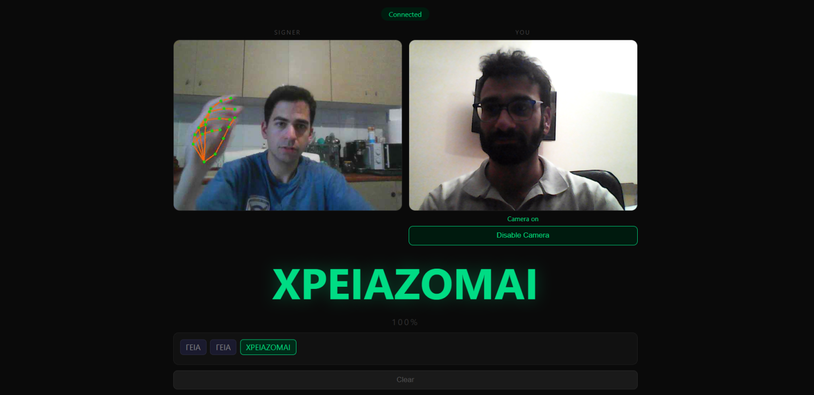
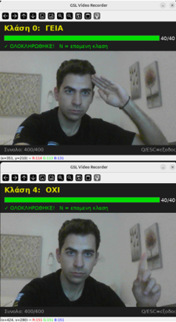
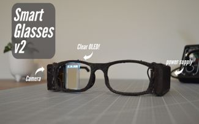

# Αναγνώριση και Μετάφραση Ελληνικής Νοηματικής Γλώσσας σε Πραγματικό Χρόνο



Ένα ολοκληρωμένο, end-to-end σύστημα Τεχνητής Νοημοσύνης για την αναγνώριση του Ελληνικού Δακτυλικού Αλφαβήτου (στατικά νοήματα) και Ελληνικών Λέξεων/Φράσεων (δυναμικά νοήματα) σε πραγματικό χρόνο, μέσω τεχνικών Μηχανικής Όρασης και Βαθιάς Μάθησης.

---

## Δομή του Έργου

Το έργο είναι δομημένο σε δύο ανεξάρτητα υποσυστήματα, το καθένα βελτιστοποιημένο για τη φύση των δεδομένων του:

1. **Greek Alphabet Recognition:** Ταξινόμηση 24 στατικών γραμμάτων χρησιμοποιώντας Μηχανική Μάθηση.
2. **Greek Phrases Recognition:** Αναγνώριση χρονικών ακολουθιών (λέξεων) χρησιμοποιώντας αρχιτεκτονικές Deep Learning και ανάπτυξη Web Server (FastAPI) για ζωντανή μετάδοση.

### Τεχνολογικό Υπόβαθρο
* **Computer Vision:** OpenCV, MediaPipe (εξαγωγή χωρικών χαρακτηριστικών / landmarks).
* **Machine Learning (Στατικά):** Multi-Layer Perceptron (MLP).
* **Deep Learning (Δυναμικά):** LSTM, BiLSTM, Transformer, SPOTER.
* **Backend & Deployment:** Python, FastAPI, Cloudflare Tunnels.

---

## Εγκατάσταση και Προαπαιτούμενα

Απαιτείται εγκατάσταση της γλώσσας Python (έκδοση 3.10 ή νεότερη) και κάμερα υπολογιστή.

**1. Κλωνοποίηση του αποθετηρίου:**
```bash
git clone https://github.com/CharalamposZisis/Greek-Sign-Language.git
cd Greek-Sign-Language
```

**2. Δημιουργία Εικονικού Περιβάλλοντος (προαιρετικά αλλά συνιστάται):**
```bash
python -m venv venv
# Για Windows:
venv\Scripts\activate
# Για Linux/Mac:
source venv/bin/activate
```

**3. Εγκατάσταση εξαρτήσεων:**
```bash
pip install -r requirements.txt
```

---

## Οδηγίες Χρήσης (Εκτέλεση σε Πραγματικό Χρόνο)

### Σύστημα 1: Αναγνώριση Στατικών Γραμμάτων
Αυτό το υποσύστημα ενεργοποιεί την κάμερα και ταξινομεί ζωντανά το δακτυλικό αλφάβητο, προβάλλοντας το ποσοστό βεβαιότητας (Confidence Score) μέσω του βέλτιστου εκπαιδευμένου MLP μοντέλου.

**Εκτέλεση:**
```bash
cd "Greek Alphabet Recognition"
python live_recognition_relative.py
```

### Σύστημα 2: Αναγνώριση Δυναμικών Λέξεων (Live Server)
Αυτό το υποσύστημα εκτελεί το μοντέλο SPOTER (Sign Pose-based Transformer) μέσω ενός FastAPI server, επιτρέποντας τη ζωντανή μετάφραση σε πραγματικό χρόνο.

**Εκτέλεση Τοπικού Server:**
```bash
cd "Greek Phrases Recognition"
python server.py
```
Ο server θα ξεκινήσει τοπικά. Μπορείτε να δείτε το περιβάλλον μετάφρασης ανοίγοντας τον browser σας στη διεύθυνση: `http://localhost:8000`

**Δημόσια Πρόσβαση (Μέσω Cloudflare):**
Για να μοιραστείτε τη ζωντανή ροή της μετάφρασης με τρίτους μέσω διαδικτύου, ανοίξτε ένα δεύτερο τερματικό και εκτελέστε:
```bash
cloudflared tunnel --url http://localhost:8000
```
Θα παραχθεί ένα προσωρινό δημόσιο URL, το οποίο μπορείτε να κοινοποιήσετε.

---

## Απόδοση Μοντέλων

Η επιλογή των τελικών μοντέλων παραγωγής (production models) έγινε κατόπιν εκτενούς αξιολόγησης και ελέγχου υπερπροσαρμογής (overfitting).

Λόγω της έλλειψης ανοιχτού συνόλου δεδομένων για το ελληνικό δακτυλικό αλφάβητο, αναπτύχθηκε ένα ειδικό εργαλείο σε Python και δημιουργήθηκε ένα προσαρμοσμένο σύνολο από το μηδέν.

### Στατικά Νοήματα (Γράμματα)
Αξιολογήθηκαν αλγόριθμοι Random Forest, KNN, SVM και MLP.
* **Επιλεγμένο Μοντέλο:** Multi-Layer Perceptron (MLP).
* **Ακρίβεια (Test Set):** 99.01%.
* **Χρόνος Συμπερασματολογίας:** 0.0025 ms / frame (αποτροπή flickering).


### Δυναμικά Νοήματα (Λέξεις)
Για την εκπαίδευση των δυναμικών μοντέλων δημιουργήθηκε ένα ενοποιημένο, υβριδικό σύνολο 5.864 δειγμάτων. 
* Αξιοποιήθηκαν 5.064 δείγματα από το δημόσιο σύνολο δεδομένων GSL. 
* Συλλέχθηκαν ειδικά από τους συγγραφείς της εργασίας μέσω κάμερας υπολογιστή (webcam) επιπλέον 800 δείγματα. 
* Τα δεδομένα αυτά ενσωματώθηκαν με τα δεδομένα του GSL dataset αυξάνοντας το συνολικό δείγμα εκπαίδευσης.



Αξιολογήθηκαν οι αρχιτεκτονικές LSTM, BiLSTM, Transformer και SPOTER. 
* **Αξιολογηθέντα Μοντέλα:** Το BiLSTM επέδειξε ακρίβεια 97.60%, το LSTM 97.21% και ο Transformer Encoder 96.21%.
* **Επιλεγμένο Μοντέλο:** Το μοντέλο SPOTER (Sign Pose-based Transformer) επέδειξε εξαιρετική απόδοση, επιτυγχάνοντας 99.77% ακρίβεια. Η υψηλή του απόδοση αποδίδεται στην αρχιτεκτονική του που συνδυάζει encoder και decoder με class query mechanism.

---

## Μελλοντικές Επεκτάσεις (Smart Glasses)

Προτείνεται η ενσωμάτωση του συστήματος σε έξυπνα γυαλιά με διαφανή οθόνη OLED. Τα έξυπνα γυαλιά θα λαμβάνουν video από μια μικρή ενσωματωμένη κάμερα, θα εκτελούν τον αλγόριθμο SPOTER σε κάποιον επεξεργαστή (όπως ένα Raspberry Pi) και θα εμφανίζουν την πρόβλεψη απευθείας στη μικρή OLED οθόνη. Αυτό θα προσφέρει πλήρη αυτονομία, επιτρέποντας στον χρήστη να βλέπει τις μεταφράσεις σε πραγματικό χρόνο χωρίς την ανάγκη για κινητό τηλέφωνο ή οθόνη υπολογιστή.



---

## Ομάδα Ανάπτυξης

Η παρούσα ερευνητική εργασία εκπονήθηκε από τους:

* **Ζήσης Χαράλαμπος**
* **Τσάμης Χρήστος**
